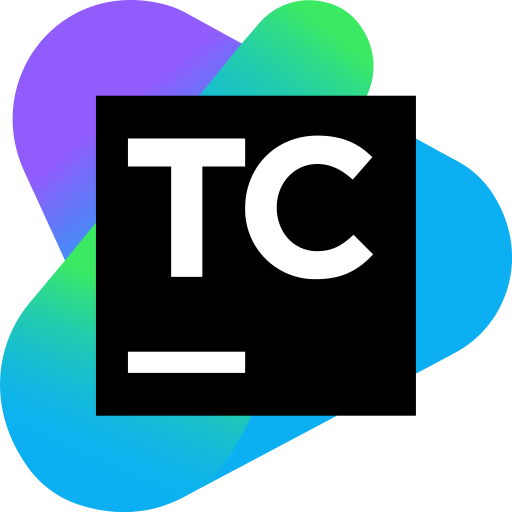

# [Team city](https://www.jetbrains.com/teamcity/)

This is just a collection of scripts for starting team city locally. 

## Requirements

Make sure docker is installed. I set up the package.json scripts while using ubuntu. So the ~ in linux for home path might not work for windows. 

## Getting started

The scripts will start the server on port 8111. Eventually I'll move the scripts out of the pacakge.json file and use an .env file to you can easily override my settings.
But, for now edit the package.json file and change my local ip address from 192.16.8.1.21 to whatever yours is.

* Install the team city docker image `yarn tc:install`

## Usage 

this will install and start the team city server. If you press ctrl+c it will stop the server.
 
* Start the server `yarn start`
* Start the agent `yarn agent`
* List the team city docker processes `yarn ps`
 
## Links
* https://www.jetbrains.com/teamcity/download/#section=docker
* https://hub.docker.com/r/jetbrains/teamcity-server/
